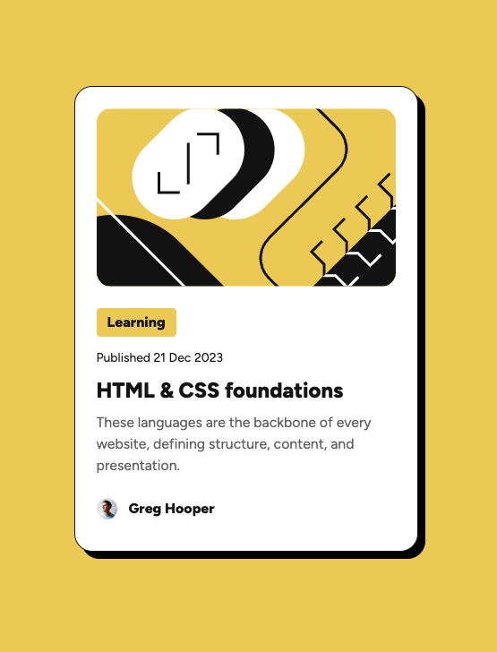
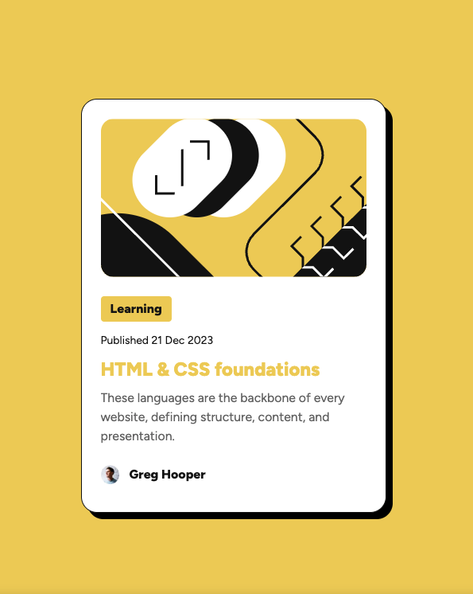

# Frontend Mentor - Blog preview card solution

This is a solution to the [Blog preview card challenge on Frontend Mentor](https://www.frontendmentor.io/challenges/blog-preview-card-ckPaj01IcS). 


## Table of contents

- [Overview](#overview)
  - [The challenge](#the-challenge)
  - [Screenshot](#screenshot)
  - [Links](#links)
- [My process](#my-process)
  - [Built with](#built-with)
  - [What I learned](#what-i-learned)
  - [Continued development](#continued-development)
  - [Useful resources](#useful-resources)
  - [AI Collaboration](#ai-collaboration)
- [Author](#author)
- [Acknowledgments](#acknowledgments)


## Overview

### The challenge

Users should be able to:

- See the blog preview card on desktop and mobile
- See hover and focus states for all interactive elements on the page

### Screenshot

#### No focus or hover



#### Focus/hover on title




### Links

- Solution URL: [Solution URL](https://github.com/andreamartz/blog-preview-card/tree/main)
- Live Site URL: [Live site URL](https://blog-preview-card-jb6thqjml-andreamartzs-projects.vercel.app/)


## My process

### Built with

- Semantic HTML5 markup
- CSS custom properties and variables in CSS Modules
- Flexbox
- Mobile-first workflow
- Fluid typography
- [React](https://reactjs.org/) - JS library
- [Next.js](https://nextjs.org/) - React framework
- [TypeScript]() - Strongly typed programming language built on top of JavaScript


### What I learned

Although I have some experience as a software engineer at a large e-commerce retailer, I chose to build this Newbie level project in order to focus on:

  - practicing working from a Figma file to achieve near pixel perfection on someone else's idea
  - developing a logical flow and order of building, starting from scratch
  - writing bite-sized commits and clear commit messages
  - accessibility
  - styling challenges I have not experienced before
  - improving my TypeScript, React, and Next.js skills

I learned that:

  - Figma specs cannot always (and sometimes should not) be literally translated into CSS. Judgment and staying true to the spirit and intention of the styles are what is needed.
  - It helps to get the html structure working for a feature before adding styling, but that's not always easy to do.
  - I learned about how to avoid media queries and adopt fluid sizing instead as viewport width changes.
  - I learned how to handle user-supplied text that is too long for its container. This may have been overkill for this challenge, but it wouldn't be for production. See line-clamp link in resources below.


### Useful resources

  - [line-clamp CSS property](https://developer.mozilla.org/en-US/docs/Web/CSS/Reference/Properties/line-clamp) - There are some legacy CSS properties that are mostly deprecated but are still supported for a very specific layout use case: truncating multi-line text.

  ```css
  .articleDescription {
    display: -webkit-box;
    overflow: hidden;
    -webkit-box-orient: vertical;
    -webkit-line-clamp: 3;
  }
  ```


  ### AI Collaboration

  TL;DR - I used AI to learn, not code for me.

  I used ChatGPT and GitHub Copilot for brainstorming and debugging.
  
  I wanted to write the code myself and get myself unstuck when I there was something I didn't know how to do. So, I did my own research on MDN and made my best attempt at solving layout issues. Then, I would ask the AI to critique my approach and tell me if there was a better one. 

  When using AI, I asked it to cite sources for its claims so that I could evaluate the authority and reliability of the answers. 

  When implementing CSS that was unfamiliar to me, I looked up each property on MDN to understand what it was doing. Then, I tried to break the rule by adding one declaration at a time in varying order/sequence to spark new questions that led to additional research and deeper understanding.


## Author

- Website - [Andrea Martz](https://andreamartz.dev/)
- Frontend Mentor - [@andreamartz](https://www.frontendmentor.io/profile/andreamartz)
- LinkedIn - [andreamartz](https://www.linkedin.com/in/andreamartz/)